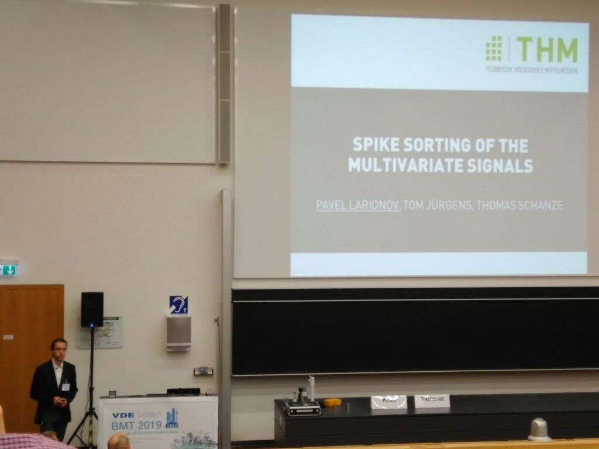
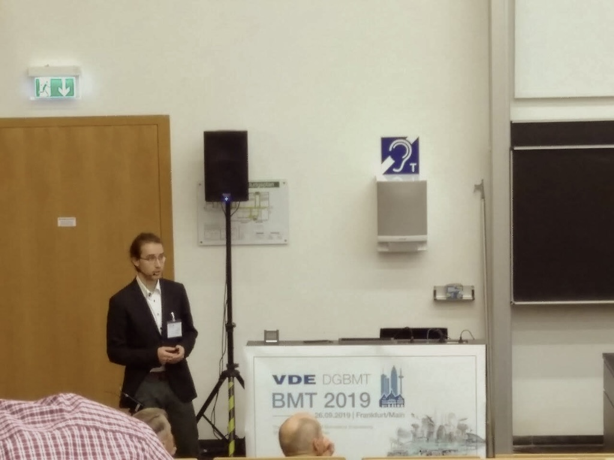

  <a href="/cv" 
  class="button" id="full-cv">｢ read full CV ｣</a>

## Summary

Analytical and visionary technical director  with a Master of Science in Biomedical Engineering and extensive experience in digital technology, leading IT projects, and driving digital transformation. Over a decade of experience in bridging the gap between technology, product development, and business strategy. Demonstrated success in pioneering projects and leveraging AI to fuel growth and enrich customer experiences. Proficient in catalyzing cooperation among diverse teams and departments to synchronize technology efforts with business objectives.

Notable projects include leading development of an award-winning iOS app [Dot Go](/projects/dot-go) for the visually impaired, [The Truth Wins](/projects/the-truth-wins) campaign to navigate around censorship and sparking AI initiatives within the company, manifested by the most recent project - [AI Eric](/projects/ai-eric), a relationship coach.

Previously engaged in biomedical technology, I contributed to neuroscience research by developing a [spike sorting](/projects/spike-sorting) algorithm, and leading a project to improve [palliative care](/projects/avenue-pal) through tech-enabled solutions. Alongside, I've always enjoyed sharing knowledge, be it through tutoring engineering subjects in the lab of my university, leading martial arts groups for kids and adults, or introducing collaborative digital tools for perpetual knowledge management to the co-workers.

I am thrilled about the boundless potential of human-machine symbiosis, and never stop exploring new ways to harness technology for meaningful solutions.

------

## Areas of Expertise

- Strategic IT and Product Vision
- AI Integration and Leadership
- Innovation & Digital Transformation
- Leading & Execution Research & Development 
- International Business & Relations
- Data-Driven Decision Making
- Idea-to-launch Product Development
- Client Engagement and Relationship Management
- Technical and Scientific Writing
- Public Speaking and Workshop Facilitation

### Languages

- English: Fluent
- German: Fluent
- Russian: Native

**List of skills is [here](/skills).** 

-----
## Professional

 

### Current Place of Work:
[**Hyperinteractive Innovation Studio**](https://hyperinteractive.de)  
Official position: Creative Technologist  
Since: Oct 2021 

What I do at Hyperinteractive:
- Lead multidisciplinary technical development units for innovative digital projects, ensuring timely and quality delivery.
- Prepare the architectural design of solutions encompassing sketches, diagrams, wireframes, roadmaps, and estimations.
- Conduct case research, refine concepts based on initial briefs, and engage with clients during pitch and kickstart meetings to ensure alignment with project objectives.
- Delivere comprehensive reports, capturing major milestones of the projects to the stakeholders.

**Significant Contributions:**
- Projects with my direct participation as leader of multidisciplinary development units, creative technologist received **more than 50 international industry awards within 2 years of assignment**, including iF design awards, Cannes Liones, Eurobest, New York Festival, Art Directors Club etc.
- Initiated and led AI development initiative, successfully integrating AI solutions in various projects.
- Initiated innovation-focused knowledge exchange within the company, which since then is held on weekly basis and was the basis for external workshops for clients and partners.

**My full CV can be found [here](/cv).**

## Education

- M.Sc. Biomedical Engineering, University of Applied Sciences Mittelhessen | [thm.de](https://www.thm.de/site/en/)  | 2017 - 2019  
- B.Sc. Biomedical Engineering, University of Applied Sciences Mittelhessen | [thm.de](https://www.thm.de/site/en/) | 2013 - 2017    
- B.A. International Relations, Sarsen Amanzholov East-Kazakhstan State University | [vku.kz](https://vku.edu.kz/en/) | 2007 - 2012  

**My full CV can be found [here](/cv).**

## Publications

 

1. [**Digitalization, Scenarios of Dying a Digitalized Society**](/projects/dying-2045)
2. [**Correlation-based Spike Sorting of Multivariate Data**](/projects/spike-sorting-multivariate)
3. [**Does Healthcare Research in Germany Need a Register of Places of Death?**](/projects/death-register-germany)
4. [**Adaption of a Spike Sorting Algorithm to ECG Signals**](/projects/spike-sorting-ecg)
5. [**Correlation Based Spike Sorting**](/projects/spike-sorting)

**My full CV can be found [here](/cv).**