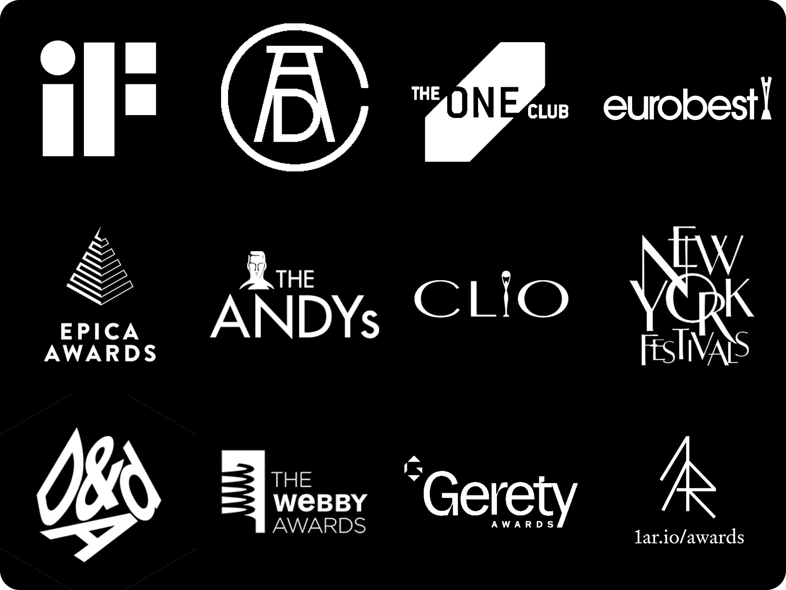

 

 **Full list of projects is [here](/projects).**

## 2023
### Dot Go App
Learn more about the Dot Go project [here](/projects/dot-go/).

| Award | Category | 
| --- | --- |
| [🏆 iF Design Award](https://ifdesign.com/en/winner-ranking/project/dot-go/568645) | design award (Communication / Apps / Software) |
| [🏆 iF Design Award](https://ifdesign.com/en/winner-ranking/project/dot-go/563656) | design award (User Interface / Digital Media Interfaces) |
| [🥈 Clio Awards](https://clios.com/awards/winner/digital-mobile-social-media-craft/dot/dot-go-the-first-object-interaction-app-for-the-vi-132090) | silver (Digital/Mobile & Social Media Craft) |
| [🥈 Clio Awards](https://clios.com/awards/winner/innovation/dot/dot-go-the-first-object-interaction-app-for-the-vi-132092) | silver (Innovation) |
| [🥉 Clio Awards](https://clios.com/awards/winner/creative-use-of-data/dot/dot-go-the-first-object-interaction-app-for-the-vi-132091) | bronze (Creative Use of Data) |
| [🥉 Clio Awards](https://clios.com/awards/winner/digital-mobile/dot/dot-go-the-first-object-interaction-app-for-the-vi-132089) | bronze (Digital/Mobile) |
| [shortlist Clio Awards](https://clios.com/awards/winner/media/dot/dot-go-the-first-object-interaction-app-for-the-vi-136087) | shortlist (Media) |
| [✏️ d&ad](https://www.dandad.org/awards/professional/2023/236525/dot-go-the-first-object-interaction-app-for-the-visually-impaired/) | graphite (Experiential / Use of MR) |
| [✏️ d&ad](https://www.dandad.org/awards/professional/2023/236525/dot-go-the-first-object-interaction-app-for-the-visually-impaired/) | graphite (Direct / Innovation) |
| [🪵 d&ad](https://www.dandad.org/awards/professional/2023/236525/dot-go-the-first-object-interaction-app-for-the-visually-impaired/) | silver (Digital / Health & Wellbeing) |
| [shortlist d&ad](https://www.dandad.org/awards/professional/2023/236525/dot-go-the-first-object-interaction-app-for-the-visually-impaired/) | shortlist (Digital / Use of Technology) |
| [🥇 webby](https://winners.webbyawards.com/2023/apps-dapps-and-software/app-features/best-practices/246824/dot-go-the-first-object-interaction-app-for-the-visually-impaired) | webby (Apps, dApps and Software Best Practices) |
| [🥇 webby](https://winners.webbyawards.com/2023/apps-dapps-and-software/app-features/best-practices/246824/dot-go-the-first-object-interaction-app-for-the-visually-impaired) | webby Apps, dApps and Software Best Practices) |
| [🥇 webby](https://winners.webbyawards.com/2023/apps-dapps-and-software/app-features/best-practices/246824/dot-go-the-first-object-interaction-app-for-the-visually-impaired) | People's Voice Award (Apps, dApps and Software / Experimental & Innovation 2023) |
| [🎖️ ADC (Art Directors Club)](https://www.oneclub.org/awards/adcawards/-award/47321/dot-go) | merit (Design for Good / Interactive) |
| [🥇 One Club](https://www.oneclub.org/awards/theoneshow/-award/48681/dot-go) | gold (Innovation & Transformation / Innovation in Interactive, Online & Mobile) |
| [🥈 One Club](https://www.oneclub.org/awards/theoneshow/-award/48691/dot-go) | silver (Augmented, Virtual & Mixed Reality) |
| [🥉 One Club](https://www.oneclub.org/awards/theoneshow/-award/47850/dot-go) | bronze (Use of Technology) |
| [🎖️ One Club](https://www.oneclub.org/awards/theoneshow/-award/48691/dot-go) | merit (Digital Design) |
| [🥇 The Andy's](https://andys.adforum.com/award-organization/6650193/showcase/2023/ad/34656131) | gold (Reset) |
| [🥇 The Andy's](https://andys.adforum.com/award-organization/6650193/showcase/2023/ad/34656131) | gold (Idea) |

## 2022
### Dot Go App
Learn more about the Dot Go project [here](/projects/dot-go/).

| Award | Category |
| --- | --- |
| [🥈 Cannes Lions](/awards/cannes-lions-Brand_Experience___Activation_-_Winner.pdf) | silver (Brand Experience & Activation) |
| [🥇 New York Festivals](https://www.nyfadvertising.com/Winners/List/e0f7632b-8c97-4c2f-b450-dcdacdc7a3ba) | gold (Innovation: Technology) |
| [🥈 New York Festivals](https://www.nyfadvertising.com/Winners/List/e0f7632b-8c97-4c2f-b450-dcdacdc7a3ba) | silver (Best Innovation) |
| [🥈 New York Festivals](https://www.nyfadvertising.com/Winners/List/e0f7632b-8c97-4c2f-b450-dcdacdc7a3ba) | silver (Product Innovation) |
| [🥈 New York Festivals](https://www.nyfadvertising.com/Winners/List/e0f7632b-8c97-4c2f-b450-dcdacdc7a3ba) | silver (Apps) |
| [🥇 Epica Awards](https://winners.epica-awards.com/2022/winner/63-00635-DIG/serviceplan-germany/dot-go-the-first-object-interaction-app-for-the-visually-impaired) | gold (Apps & Games) |
| [🥈 Epica Awards](https://winners.epica-awards.com/2022/winner/35-00634-DIG/serviceplan-germany/dot-go-the-first-object-interaction-app-for-the-visually-impaired) | silver (Creative Use of AI) |

### The Truth Wins
Learn more about the Truth Wins project [here](/projects/the-truth-wins/).

| Award | Category |
| --- | --- |
| [🥈 Cannes Lions](https://www.lovethework.com/en-GB/awards/pr-196?year=2022) | silver (PR Lions) |
| [🥈 Cannes Lions](https://www.lovethework.com/en-GB/awards/sustainable-development-goals-200?year=2022) | bronze (Sustainable Development Goals Lions) |
| [🥇 Eurobest](https://www.lovethework.com/en-GB/eurobest/media?entry_type_id=7&year=2022) | gold (Media) |
| [🥉 Eurobest](https://www.lovethework.com/en-GB/eurobest/media?entry_type_id=7&year=2022) | bronze (Culture & Context) |
| [🥉 Eurobest](https://www.lovethework.com/en-GB/eurobest/pr?entry_type_id=11&year=2022) | bronze (Social Engagement & Influencer Marketing) |
| [🥉 Eurobest](https://www.lovethework.com/en-GB/eurobest/social-influencer?entry_type_id=5&year=2022) | bronze (Social Insights & Engagement) |
| [shortlist Eurobest](https://www.lovethework.com/en-GB/eurobest/direct?entry_type_id=6&year=2022) | shortlist (Direct) |
| [shortlist Eurobest](https://www.lovethework.com/en-GB/eurobest/social-influencer?entry_type_id=5&year=2022) | shortlist (Social & Influencer) |
| [🥇 Gerety Awards](https://www.geretyawards.com/?action=ows:entries.details&e=95871&project_year=2022) | gold (MEDIA CUT - MOBILE) |
| [🥈 Gerety Awards](https://www.geretyawards.com/?action=ows:entries.details&e=95839&project_year=2022) | silver (WORK FOR GOOD CUT - MOBILE) |
| [🥉 Gerety Awards](https://www.geretyawards.com/?action=ows:entries.details&e=95840&project_year=2022) | bronze (COMMUNICATION CUT - MOBILE) |

## 2021
### Dot Go App
Learn more about the Dot Go project [here](/projects/dot-go/).

| Award | Category |
| --- | --- |
| [🏆 Eurobest](https://www2.eurobest.com/winners/2021/innovation/index.cfm?award=1) | grand prix (Innovation) |
| [🥈 Eurobest](https://www2.eurobest.com/winners/2021/interactive/entry.cfm?entryid=2906&award=3) | silver (Digital Craft) |

