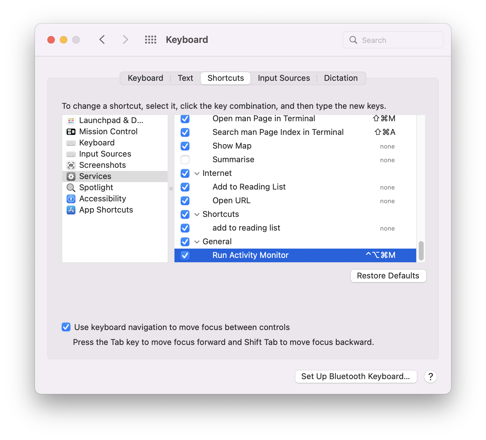

`/Users/USERNAME/Library/Services/Run Activity Monitor.workflow`

 

Credits are going to: [Is there a keyboard shortcut for launching Activity Monitor?](https://apple.stackexchange.com/questions/1520/is-there-a-keyboard-shortcut-for-launching-activity-monitor)

