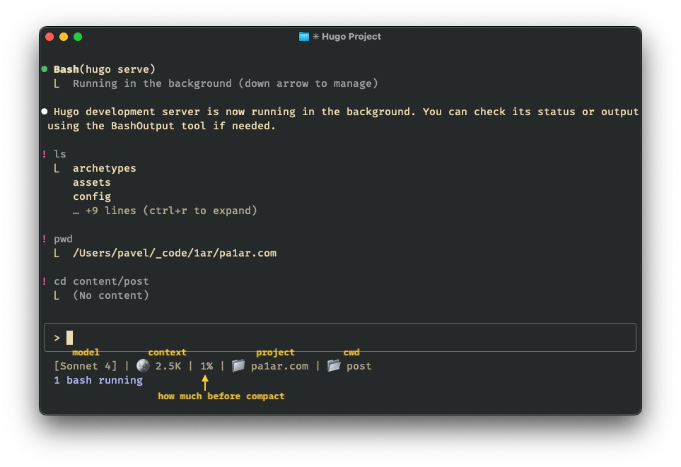

## The Problems

1. Claude Code has a 200K token context window, and it automatically runs `/compact` when you hit around 80% usage. But you won't know you're approaching the limit until it's too late - causing context loss and confused responses.
2. The default statusline doesn't provide enough information about the current project and directory.

## Solution: Custom Statusline

With the new [statusline customization](https://docs.anthropic.com/en/docs/claude-code/statusline), you can create a statusline that shows real-time token usage, project folder and current directory:

```
[Sonnet 4] | 🪙 56.8K | 35% | 📁 project-name | 📂 current-dir
```



## Setup

### Step 1: Create the Script

Save this to `~/.claude/statusline-custom.sh`:

```bash
#!/bin/bash

# Configurable threshold (default: 160K tokens = 80% of 200K context)
THRESHOLD=${CLAUDE_AUTO_COMPACT_THRESHOLD:-160000}

# Read JSON input from stdin
input=$(cat)

# Extract values using jq
MODEL_DISPLAY=$(echo "$input" | jq -r '.model.display_name')
PROJECT_DIR=$(echo "$input" | jq -r '.workspace.project_dir')
CURRENT_DIR=$(echo "$input" | jq -r '.workspace.current_dir')
SESSION_ID=$(echo "$input" | jq -r '.session_id')

# Get directory names
PROJECT_NAME=$(basename "$PROJECT_DIR")
CURRENT_NAME=$(basename "$CURRENT_DIR")

# Calculate tokens from transcript
TOTAL_TOKENS=0
if [ -n "$SESSION_ID" ] && [ "$SESSION_ID" != "null" ]; then
    TRANSCRIPT_PATH=$(find ~/.claude/projects -name "${SESSION_ID}.jsonl" 2>/dev/null | head -1)
    if [ -f "$TRANSCRIPT_PATH" ]; then
        # Estimate tokens (rough approximation: 1 token per 4 characters)
        TOTAL_CHARS=$(wc -c < "$TRANSCRIPT_PATH")
        TOTAL_TOKENS=$((TOTAL_CHARS / 4))
    fi
fi

# Calculate percentage
PERCENTAGE=$((TOTAL_TOKENS * 100 / THRESHOLD))
if [ $PERCENTAGE -gt 100 ]; then
    PERCENTAGE=100
fi

# Format token count with K notation
if [ $TOTAL_TOKENS -ge 1000 ]; then
    TOKEN_DISPLAY=$(echo "scale=1; $TOTAL_TOKENS / 1000" | bc)"K"
else
    TOKEN_DISPLAY="$TOTAL_TOKENS"
fi

# Output statusline
printf "[%s] | 🪙 %s | %d%% | 📁 %s | 📂 %s" "$MODEL_DISPLAY" "$TOKEN_DISPLAY" "$PERCENTAGE" "$PROJECT_NAME" "$CURRENT_NAME"
```

### Step 2: Configure Claude Code

Add to `~/.claude/settings.json`:

```json
{
  "statusLine": {
    "type": "command",
    "command": "~/.claude/statusline-custom.sh"
  }
}
```

### Step 3: Make Executable

```bash
chmod +x ~/.claude/statusline-custom.sh
```

## Customization

### Adjust Auto-Compact Threshold

```bash
export CLAUDE_AUTO_COMPACT_THRESHOLD=180000  # 90% of 200K
```

### Format Breakdown

- `[model]` - Current Claude model
- `🪙 tokens` - Token count in K notation  
- `percentage%` - Progress to auto-compact
- `📁 project` - Project directory name
- `📂 cwd` - Current working directory

## Why This Works

- **Real-time tracking**: Updates as conversation grows
- **Visual indicators**: Emojis make info scannable
- **Configurable threshold**: Tune based on observed behavior
- **Lightweight**: Uses existing transcript data

## Sources

Based on the excellent work by [@pnd](https://zenn.dev/pnd/articles/claude-code-statusline) - check out their original Japanese article for explanations and more insights.