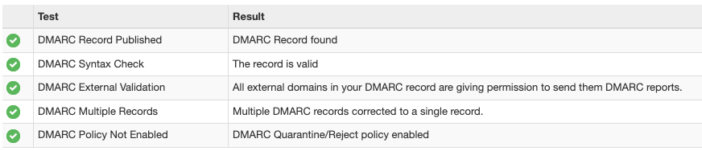

> Someone could be spoofing your custom email address right now.  
> It's possible to make an email look like it's coming from your custom email (e.g., to ask people to pay a fake bill). Even if you use something like iCloud Custom Email Domain, you might be at risk.  

In this article, we'll discover ways to secure your custom email domain with DMARC, SPF, and DKIM records.



## Why & How

Apple has Custom Domain Email feature that allows you to use your domain with iCloud Mail. It's a great feature, but it's not bulletproof.  

While Apple instructs you to add some layers of protection (DKIM, SPF records) during initial setup and connection of your domain with iCloud, you might want to add a DMARC record to make it bulletproof.  

Let's break down all these abbreviations.

## What's DMARC
(Domain-based Message Authentication, Reporting & Conformance)
- Email auth protocol

### What DMARC Does
- Ensures that email from your domain is properly authenticated
- Instructs email servers on how to handle messages that fail to authenticate

Learn more about DMARC on [this](https://dmarc.org/) old-school website.

### Why Use DMARC
- Prevents email spoofing, phishing, etc. by handling emails sent from unknown servers and/or without signatures
- Improves deliverability (properly authenticated legit emails are less likely to be marked as spam)

### Possible Vector of Attack
- If DMARC record isn't present, malicious actors can send out emails appearing to come from your email (e.g., asking to pay, leak info, etc.)


### Test Your Domain with SuperTool
You can test your domain with [SuperTool](https://mxtoolbox.com/SuperTool.aspx) and see if the records are present.



## How to Add the Record on Cloudflare

1. Log in to Cloudflare
2. Select your domain
3. Navigate to DNS settings
4. Add DMARC record:
   - “Add Record”
   - Select TXT as the type
 - `Name` field: 
```
_dmarc
```
   - `Content` field:
```
v=DMARC1; p=reject; rua=mailto:dmarc-reports@yourdomain; ruf=mailto:dmarc-reports@yourdomain; pct=100
```  
  Replace `yourdomain` with your actual domain, also you can change the `p` parameter to `quarantine` [servers will mark unauthenticated emails as spam] or `none` [will send you a report whenever someone is trying to spoof - monitoring mode]   

 5. Save

## DMARC Works Together with SPF and DKIM

### SPF: Sender Policy Framework
- Ensures only authorized servers can send emails from your domain

### DKIM: DomainKeys Identified Mail
- Adds a digital signature to verify the sender and integrity of the email

### Example of a Value for SPF Record
If you use Apple iCloud custom domain mail feature:

```
v=spf1 include:icloud.com ~all
```

- `v=spf1` is the version of the SPF record
- `include:icloud.com` means that the servers listed in the `icloud.com` SPF record are allowed to send emails on behalf of your domain
- you can include google, microsoft, etc. too, e.g. `include:_spf.google.com include:calendar-server.bounces.google.com ~all`
- the `~all` part means that if the server isn't on the list, it should be treated as neutral (not necessarily spam), it's basically a monitoring mode. You can change it to `-all` to reject all emails that are not on the list.
- If you've set up iCloud custom domains, you were instructed to add SPF record alongside DKIM to your DNS
- If you work with Google Workspace and verified your domain, you can receive a generated DKIM from them too (optionally though, which is a bit weird by default, IMO)

## Conclusion

> DMARC effectively orchestrates what DKIM and SPF are limiting

- SPF limits who can send by specifying servers
- DKIM limits tampering by signing
- DMARC uses the results from SPF and DKIM to instruct receiving email servers on how to handle emails that fail these checks

### Takeaways

- Adding DMARC, SPF, and DKIM improves email security and protects your domain from misuse
- While some records are added when you set up a custom domain (SPF and DKIM), others are not (DMARC)
- It's worth checking your DMARC report with 3rd party tools