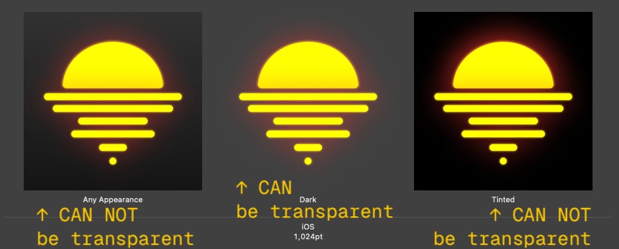
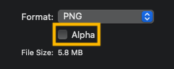

> If this sounds too familiar: `Invalid large app icon. The large app icon in the asset catalog in "appname.app" can't be
transparent or contain an alpha channel. For details, visit: https://developer.apple.com/design/human-interface-guidelines/app-icons. (ID: id_number)` and you are seeing this error way too often while trying to archive and upload your app to the App Store, then you are in the right place.

According to the new iOS 18 guidelines, the large app icon (by LARGE Apple means 1024x1024, they are just afraid of numbers) must consist of three pieces of assets: 

- Any appearence 
- Dark 
- Tinted 

The trick is, that only DARK APPEARENCE can be transparent. The other two must have a solid background. Somehow they fail to mention that in the error message.

Anyways, if you use Figma to design your icons, then most probably your icons do have transparency layers, even if the layers are 100% opaque, but that' is another story. So the easiest way to solve the issue is:

1. Export files from Figma
2. Open the icon which you want to use for `Any Appearence` in Preview
3. Export it as PNG 
4. UNCHECK the Alpha channel
5. Repat the process for the `Tintend` one

Now put the files in place of the old ones and clean the xcode cache (⌘+Shift+K). 

That's it. Hope you haven't tried to figure this out for 1+ hours like me. 

Follow me on X if you want btw. 

