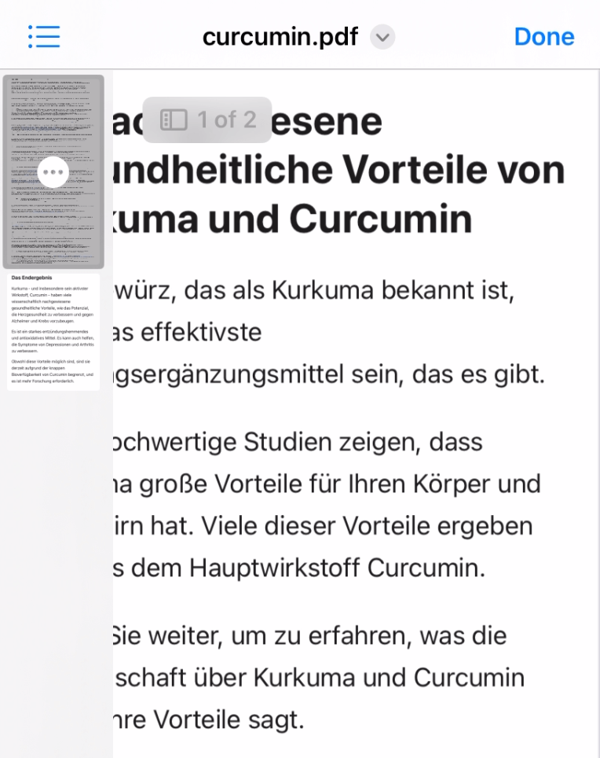

For the situations when you need to remove one or another page, or add additional page to you PDF file on iPhone.

1. open PDF in files
2. tap on pages indicator (top left)
3. tap on page after which you want to add pages (or which you want to remove)
4. “insert from file” (“delete”)
5. (select files)
6. “done”



