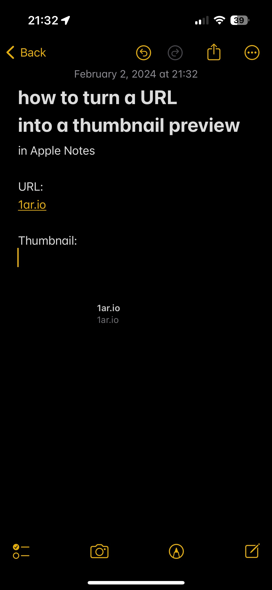
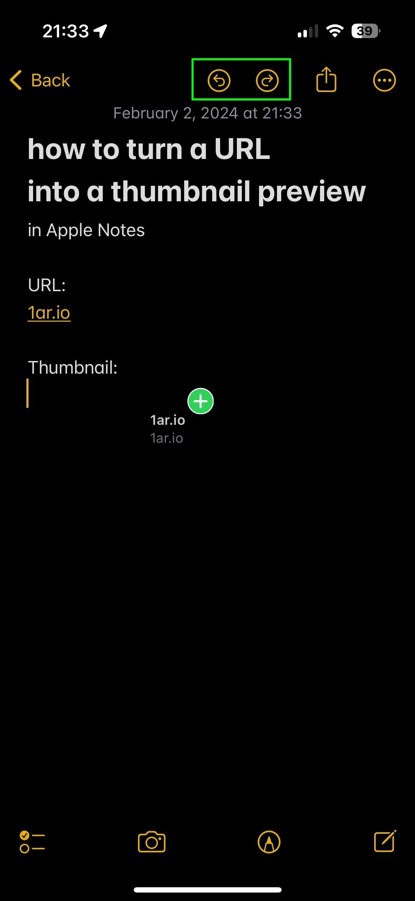

> Apple Notes creates beautiful thumbnails for URLs, when you share a URL to the note. Unfortunately, there is no straightforward way to create a thumbnail on demand while you are writing the note, e.g. I'd expect smth like long tap → create thumbnail or smth. 

Maybe someday we will have an easier way, but for now there is a workaround. It works for both [iOS](/p/thumbnail-apple-notes/#how-to-create-a-thumbnail-preview-for-a-url-from-within-the-apple-notes-on-ios-iphoneipad) and [MacOS](/p/thumbnail-apple-notes/#how-to-create-a-thumbnail-preview-for-a-url-from-within-the-apple-notes-on-macos-macbook).

## How to create a thumbnail preview for a URL from within the Apple Notes on iOS (iPhone/iPad)

The trick is to **simulate drag-and-drop** while inside of the app.  
In other words, we need force the green  `+`  sign to appear.

### Method 1, easy

This method was proposed by [@soundsgoodtome on YouTube](https://www.youtube.com/shorts/8T088LlOxko) in comments under the first video I have published on this topic with ([Method 2](/p/thumbnail-apple-notes/#method-2-original)). Since then I am only using Method 1.

  

1. create/open a note
2. paste/type textual URL to the note
3. tap and hold on the URL
4. tap with another finger on the UNDO button 
- green plus should appear near the plate with the URL as drag-and-drop mode activates at that moment
5. tap REDO to preserve the state of the note after pressing UNDO
9. remove finger from the screen to paste the thumbnail



### Method 2, original

This method is somewhat tricky, hence not recommended.

1. create/open a note
2. paste/type textual URL to the note
3. dismiss keyboard (swipe down outside of the keyboard)
4. tap and hold on the URL
5. move it out of the way so that you can see the body of the note
6. tap with another finger on the body of the note (goal is to call the keyboard again)
- at that point, green plus should appear near the plate with the URL you should still be holding with your finger
8. point with the cursor where you would like to place the thumbnail
9. remove finger from the screen to paste the thumbnail

  

For some really weird reason, sometimes this plus appears later, so occasionally the process needs to be repeated.



## How to create a thumbnail preview for a URL from within the Apple Notes on MacOS (Macbook)

You can do the same on MacOS, but the process is a bit different and even more weird. The principle remains the same - we need to drag-and-drop the URL to the body of the note.

> You must have a trackpad for this to work, as you will need forcetouch to open the quick preview of the URL.

1. create/open a note
2. paste/type textual URL to the note
3. use trackpad to click and hold on the URL
4. the preview will open (you can release the trackpad)
5. click and drag the URL from the preview; you need to select URL which will lead to the page you want to create a thumbnail for.
6. drag the URL-plate to the body of the note
7. release the trackpad to paste the thumbnail
8. repeat if needed, as you can drop as many thumbnails as you want from this preview (it won't close until you click outside of it)

 

Here is a video to demonstrate the process on macos:



I hope it helps and would be happy if you could let me know if you can reproduce this. Feel free drop a comment here, [tag/DM me on 𝕏](https://x.com/pa1ar/status/1744852069385994705?s=20) or drop a comment on [YouTube](https://www.youtube.com/@pa1ar)/[TikTok](https://www.tiktok.com/@1ar.io/video/7322218545662807329?is_from_webapp=1&sender_device=pc&web_id=7319913510544295457).