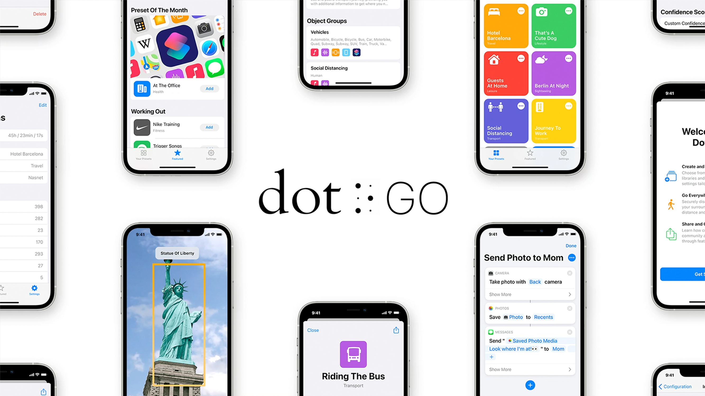

## What  
Dot Go is an [iOS app](https://dot-go.app/) for visually impaired persons, which helps users identify objects and trigger actions. The core idea of the app is simple yet powerful - `real objects trigger actions`. 

- iPhone's LiDAR to estimate the distance to the object accurately 
- computer vision algorithms to recognize common objects in the surroundings

The workflow of the app:
1. Set a target object (e.g., socks) 
2. Set up a scenario (e.g., play sound)
3. (Optionally - run shortcut, e.g., check out an item in Apple Reminders) 



As a result, as soon as a target object is recognized (user points smartphone at socks), the action is initiated (sound is played, and reminder is checked out). So a hypothetical user can now make lists of things easily, which is especially useful in, for example, unknown environments (while travelling). 

The computer vision algorithm is optimized to work on-device, so no internet and no external API are required to use the app. The UI of the app is built and implemented by following accessibility guidelines, which were tested by real users. 

## My Role
I joined the project as a creative technologist when a proof of concept was done, but the requirements changed and the quality had to increase. So my first task was to redefine the scope, the metrics, and the desired outcome and get all stakeholders aligned about the new course of actions. Based on the created documentation, we decided to refresh the design and upgrade our object recognition algorithms, while having usability by the target audience (visually impaired users) as our main priority. After several sporty sprints, during which I led the developers team and kept in touch with designers and the agency, we rebuilt the app and delivered the project on time and in the required quality to the stakeholders.

## Where / With Whom  
The app was implemented by [Hyperinteractive Innovative Studio](https://www.hyperinteractive.de/dot-go/) in collaboration with [L2-Labs](https://l2-labs.com/) company. The product was created by the initiative of [Dot Inc.](https://www.dotincorp.com/) - an innovative Korean accessibility-focused company and a creative agency, [Serviceplan](https://www.house-of-communication.com/).

## When  
I joined the project in October 2020 (the project started in mid 2020) and was finished in Spring 2021.

## So What?  
The app won a relatively large number of awards (32), including the Eurobest Grand Prix and [iF design award](https://ifdesign.com/en/winner-ranking/project/dot-go/568645), and won in multiple categories on various international platforms. 
