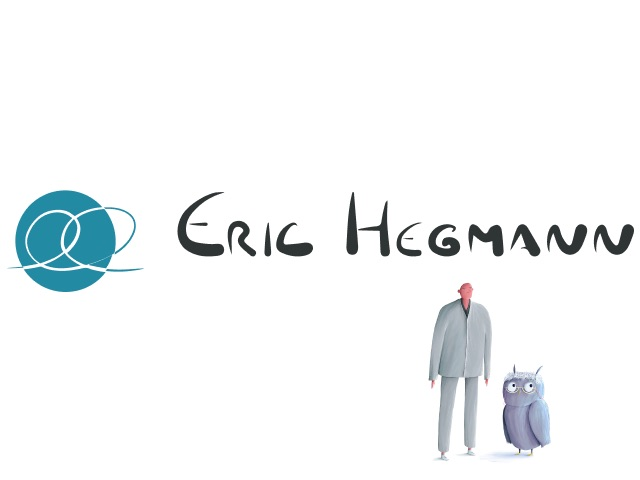

## what - LLM based AI chatbot trained to act like a real couple therapist
Digital twin of a real therapist, trained on decades of practice, dozens of books and interviews of [Eric Hegmann](https://www.eric-hegmann.de/) - popular German couple therapists.  
The bot is powered by a [state-of-the-art large language model](https://openai.com/blog/openai-api) (LLM), which gives it enormous generalization boost. That said, to avoid any hallucinations and make the digital twin act like a real prototype (Eric himself), the bot was re-trained on large dataset of quesitons and ansewres, anonymized interventions and interviews held by Eric.  
Besides that, we went extra-mile making the conversations to be stored in a secure way by implementing an encryption algorithm. 

> AI-powered coach is able to democratize access to therapy on scale.

## my role
After I have started the initiative of building the AI-powered chatbots in the company ([Hyperinteractive Innovation Studio](https://www.hyperinteractive.de/)) and creating several proofs-of-concept, I acted as tech-lead and creative technologist throughout development of the solution for Eric Hegmann, which included leading the team of developers, prompt engineering and dataset processing. Besides that, I was planning and overseeing the launch of the solution, including test-phases, surveys, and analysis of the QA results. 

## where / with whom  
The implementation of the intelligent-website technology (sAIpien) is the property of Hyperinteractive Innovation Studio, Eric AI is whitelabel solution for one of Hyperinteractive's clients. Significant during implementation contributions also came from Frédéric Urien, who took care of the solution's setup, prompting and client's communication in the first phase of the project, from Katya Kovaleva, who took care of the project's timeline and social media announcements and from our CEO Dieter Pries, who was directing the project and brought the client in the first place. Of course, the AI coach implementation wouldn't be possible without Eric's support, open-mindness and enthusiasm. 


Demo showcases example of the conversation with the AI coach, featuring cross-session memory.

## when  
2023-2024

## so what?  
As it was predicted in the [chapter of the book](/projects/dying-2045/) I have participated - AI therapist (or, as it called in this case - coach) bots are starting to roll out. It is truly amazing, that I was able to took part in this development just one year after I made an educated guess, that such tools will be on a rise.  
In the meantime, the AI Eric was tested by more than 200 people, with no negative feedback. The purpose of the first test was to figure out how stable the bot is. Two-phased testing shows amazing results, which we have captured in Eric AI launch [announcement](https://www.instagram.com/p/C3D2ldFMBly/).
I am excited and hopeful, that this kind of solutions will make the therapy more accessible and will make the world a better place with happier people.