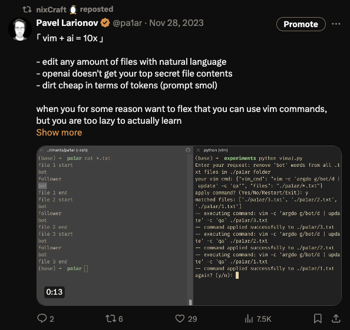

## what  
Natural language AI-powered CLI tool to effortlessly edit one or multiple text files.  

Example of the commands: 
- formatting lines in files (e.g. email addresses or HTML tags)
- removing words
- replacing words
- etc.

> As we all know it's dangerous to [enter vim](https://stackoverflow.blog/2017/05/23/stack-overflow-helping-one-million-developers-exit-vim/). So I've created a CLI tool that will allow you to edit text files with vim-commands without actually putting yourself in danger of being trapped in vim forever. 

Basically you can apply any vim-commands on multiple files without actually knowing a single vim-command. I am not saying you should though. 

## demo



## how it works
- you run `vimai` in your terminal
- you enter your request in natural language, including the files you want to edit  

Example:  
 `i want to remove all lines with "example" from file1.txt and file2.txt`

- vimai will come up with a command and output it for you to confirm
- you can apply the command or relaunch the request
- after confirmation, vimai will apply the command on the files

## where / with whom
This was a personal project made solo by me.

## availability


Be advised that it's largely a demo project, AI can hallucinate, so probably do not edit your entire production codebase with it.

## when  
- Created in November 2023 ([demo published on X](https://x.com/pa1ar/status/1729296393485910192))  
- Open-sourced in March 2024

## so what?  
I have made a small prototype back in November 2023 just for fun and recorded a demo video which you can see above. I've posted it on my [twitter](https://x.com/pa1ar/status/1729296393485910192) and shared with a couple of collegues just to have some laughs about it during weekly coffee call.  

- In March 2024 I've quoted my post under a meme post which was reposted by [nixcraft](https://x.com/nixcraft) (niche but popular in certain circles account posting curious and fun stuff about linux, opensource, programming, sysadmin and network stuff). 
- nixcraft asked if vimai is opensource, so I've decided to make it a bit more polished and share it on github. 
- After me confirming that vimai is opensource, my post with a demo ended up "featured" ([reposted](https://x.com/pa1ar/status/1729296393485910192)) by nixcraft. 

That was nice.  

What was even nicer - later on, [iTerm](https://iterm2.com/) (a popular terminal emulator for MacOS) have [implemented](https://gitlab.com/gnachman/iterm2/-/wikis/AI-Prompt) similar feature "AI Prompt":

<blockquote class="twitter-tweet" data-lang="en" data-dnt="true" data-theme="dark">
ITerm has integrated AI to assist you with writing commands  very cool and very similar to what my vimai tool was doing (even showcase is almost identical) ;D my vimai (created in Nov 2023, opensourced in 2024) can be used in any terminal emulator though =P <a href="https://t.co/YXg8P10fIS">https://t.co/YXg8P10fIS</a> <a href="https://t.co/hsPlDOHcH8">pic.twitter.com/hsPlDOHcH8</a>
&mdash; Pavel Larionov (@pa1ar) <a href="https://twitter.com/pa1ar/status/1792948472183738735?ref_src=twsrc%5Etfw">May 21, 2024</a></blockquote> 
